<!--
  KENYANG'S PROFILE README
  Search for "EDIT ME" to find the quickest customization points.
  The full editing guide is in CUSTOMIZE.md.
-->

  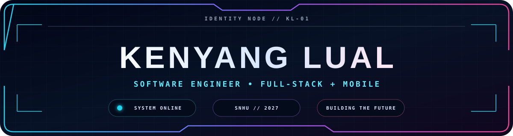

<h3 align="center">
  <samp>
    &gt; Hey there! I am
    <b><a href="https://www.linkedin.com/in/kenyanglual/">Kenyang Lual</a></b>
  </samp>
</h3>

  <samp>「 I build approachable web, mobile, and API experiences that help people move forward. 」</samp>

<!-- EDIT ME: Change the phrases after "lines=" to update the typing animation. -->

  

  


  

  <a href="https://www.klual.com/">
    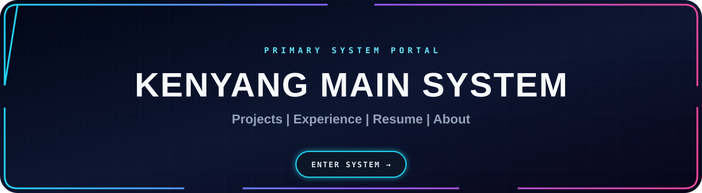
  </a>

 
 

  <samp>PROJECT NODES // SELECT A BUILD</samp>

 

  <a href="https://github.com/Kenyang1/guardian-app">
    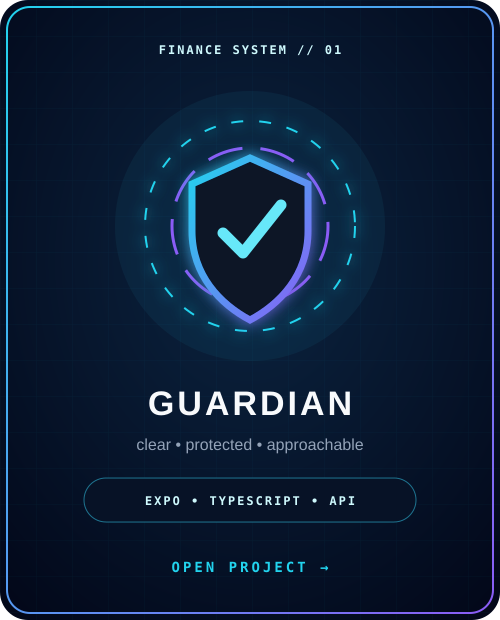
  </a>
  <a href="https://github.com/Kenyang1/aspireAI">
    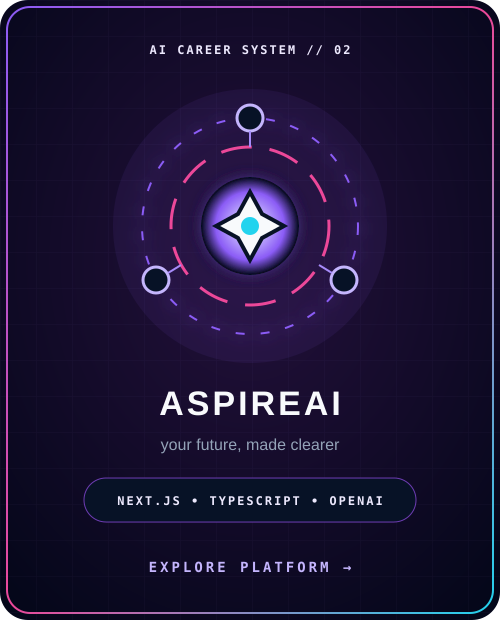
  </a>
  <a href="https://github.com/Kenyang1?tab=repositories">
    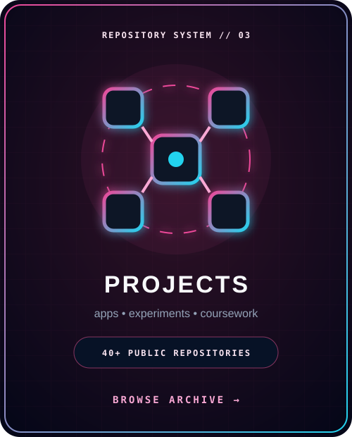
  </a>

  

## 🛠 Technologies, Projects, and Domains

<table border="0" cellspacing="10" cellpadding="0">
  <tr>
    <td width="420" valign="top" align="center">
      <h3>🛠 Technologies</h3>
       
      <table align="center" cellspacing="0" cellpadding="7">
        <tr>
          <td align="center"></td>
          <td align="center"></td>
          <td align="center"></td>
          <td align="center"></td>
        </tr>
        <tr>
          <td align="center"></td>
          <td align="center"></td>
          <td align="center"></td>
          <td align="center"></td>
        </tr>
        <tr>
          <td align="center"></td>
          <td align="center"></td>
          <td align="center"></td>
          <td align="center"></td>
        </tr>
        <tr>
          <td align="center"></td>
          <td align="center"></td>
          <td align="center"></td>
          <td align="center"></td>
        </tr>
      </table>
    </td>
    <td width="260" valign="top" align="center">
      <h3>🧪 Projects</h3>
       
      <a href="https://github.com/Kenyang1?tab=repositories">
        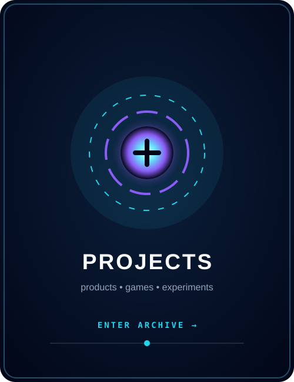
      </a>
    </td>
    <td width="260" valign="top" align="center">
      <h3>🧠 Domains</h3>
       
      <a href="https://www.klual.com/">
        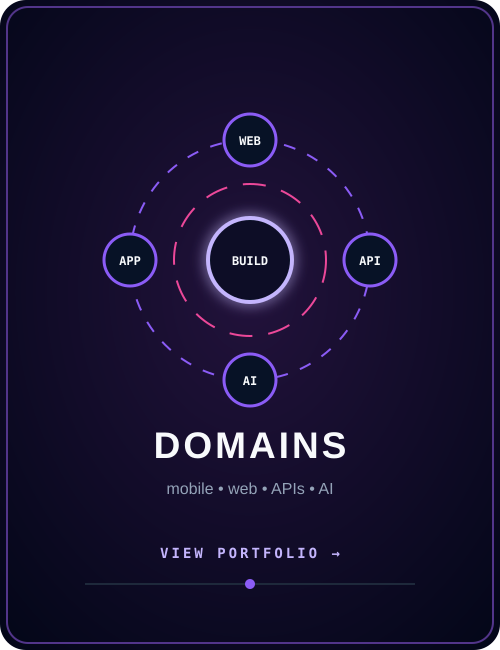
      </a>
    </td>
  </tr>
</table>

### 📊 Vital Statistics

  

  

  

  

<table width="100%" border="0" cellspacing="10" cellpadding="0">
  <tr>
    <td width="33%" valign="top">
      <h2>🤝 Collaboration</h2>
      
I am open to collaborating on:

      <ul>
        <li>Human-centered web and mobile products</li>
        <li>Student and education technology</li>
        <li>Personal-finance tools</li>
        <li>AI-powered career guidance</li>
      </ul>
    </td>
    <td width="34%" align="center" valign="middle">
      <a href="mailto:kenyanglual05@gmail.com">
        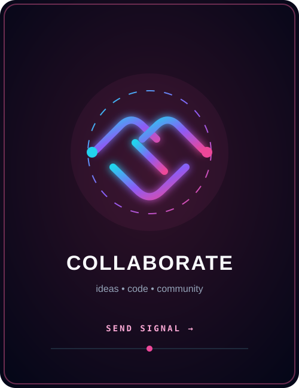
      </a>
    </td>
    <td width="33%" valign="top" align="center">
      <h2>📫 Contact</h2>
       
      
        
      
        
      
    </td>
  </tr>
</table>

  ⚡ Building approachable technology, one system at a time.

  <a href="./CUSTOMIZE.md">System manual</a> ·
  <a href="https://github.com/Kenyang1?tab=repositories">Project archive</a> ·
  <a href="https://www.klual.com/">Portfolio</a>

### 🕹 Pac-Man Contribution Grid

  <samp>LIVE ACTIVITY FEED // UPDATED DAILY</samp>

<!-- This animation is generated by .github/workflows/arcade.yml after it reaches main. -->
<picture>
  <source media="(prefers-color-scheme: dark)" srcset="https://raw.githubusercontent.com/Kenyang1/kenyang1/output/pacman-contribution-graph-dark.svg" />
  <source media="(prefers-color-scheme: light)" srcset="https://raw.githubusercontent.com/Kenyang1/kenyang1/output/pacman-contribution-graph.svg" />
  
</picture>

  Generated from my GitHub contribution history.

  

