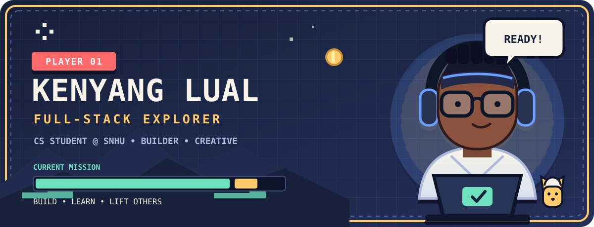

<!--
  KENYANG'S PROFILE README
  Quick edits are labeled "EDIT ME" below.
  For a complete walkthrough, open CUSTOMIZE.md.
-->

<div align="center">
  

  <br />

  <!-- EDIT ME: Update these destinations if your links change. -->
  <a href="https://www.klual.com/"></a>
  <a href="https://www.linkedin.com/in/kenyanglual/"></a>
  <a href="mailto:kenyanglual05@gmail.com"></a>
</div>

## `PLAYER_01` · character card

<!-- EDIT ME: Change any value in the right column as your story evolves. -->

| Attribute | Current loadout |
| :--- | :--- |
| **Name** | Kenyang Lual |
| **Class** | Full-Stack + Mobile Developer |
| **Origin story** | First-generation college student |
| **Guild** | Computer Science @ SNHU · Class of 2027 |
| **Current party** | Software Engineering Intern @ Fidelity Investments |
| **Home base** | Manchester, New Hampshire |
| **Main quest** | Build approachable technology that helps people discover, organize, and understand what matters |
| **Party buff** | Curiosity + community + faith |

```text
ENERGY    ♥ ♥ ♥ ♥ ♥
CURIOSITY ██████████  MAX
LEARNING  ████████░░  ALWAYS IN PROGRESS...
STATUS    [ ONLINE AND BUILDING ]
```

## `QUEST_LOG` · what I am working toward

<!-- EDIT ME: Replace these quests whenever your focus changes. -->

- 🛡️ **Main quest:** Grow **Guardian**, an approachable personal-finance experience for mobile and web.
- 🧠 **Skill quest:** Level up in system design, algorithms, and dependable full-stack architecture.
- 🤖 **Discovery quest:** Explore where AI can make everyday tools more useful and human.
- 🌍 **Co-op quest:** Use technology to strengthen communities and help others move forward.

## `ADVENTURE_MAP` · featured builds

<!-- EDIT ME: Swap a table row to feature a different repository. -->

| World | Mission | Power-ups |
| :--- | :--- | :--- |
| [**🛡️ Guardian**](https://github.com/Kenyang1/guardian-app) | Make budgeting feel clear, protected, and approachable across mobile and web. | `Expo` `React Native` `TypeScript` |
| [**⚙️ Guardian API**](https://github.com/Kenyang1/guardian-api) | Power Guardian with typed, tested endpoints and secure user-scoped data. | `Express` `Zod` `PostgreSQL` |
| [**🐈 Chef Cat Platformer**](https://github.com/Kenyang1/cat-platformer) | Turn a chef-cat sprite sheet into a playable platformer with movement and double jumps. | `Python` `Pygame` `Pixel Art` |
| [**🗺️ Portfolio**](https://github.com/Kenyang1/portfolio) | Tell the story behind my work, education, creativity, and growth as a developer. | `HTML` `CSS` `JavaScript` |

## `INVENTORY` · tools collected

<!-- EDIT ME: Add or remove badge lines as your toolkit changes. -->

<div align="center">

**Languages**


**Frameworks + tools**


</div>

## `STATS_ROOM` · live player data

<div align="center">
  
  
</div>

<div align="center">
  
</div>

## `ARCADE_MODE` · contributions in motion

<!--
  This image is generated by .github/workflows/arcade.yml.
  It appears after the workflow runs once on GitHub.
-->

<picture>
  <source media="(prefers-color-scheme: dark)" srcset="https://raw.githubusercontent.com/Kenyang1/kenyang1/output/pacman-contribution-graph-dark.svg" />
  <source media="(prefers-color-scheme: light)" srcset="https://raw.githubusercontent.com/Kenyang1/kenyang1/output/pacman-contribution-graph.svg" />
  
</picture>

<div align="center">

### `PRESS START TO SAY HELLO`

I enjoy meeting people who care about thoughtful products, creative engineering, and technology with a purpose.

[](https://www.klual.com/)
[](https://www.linkedin.com/in/kenyanglual/)
[](mailto:kenyanglual05@gmail.com)

<sub>Want to change a quest, color, link, or project? Open the <a href="./CUSTOMIZE.md">customization guide</a>.</sub>

</div>
